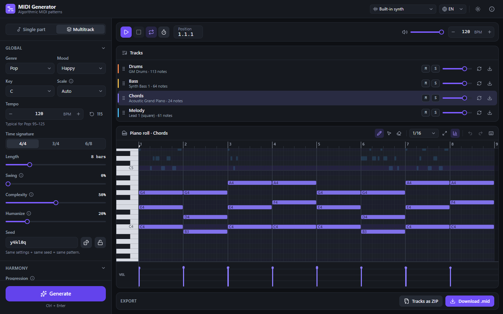

# MIDI Generator

**English** · [Русский](README.ru.md)

A web app that writes MIDI patterns with music algorithms, not AI. Pick a genre, mood, key and
parts, then generate, listen and edit in an FL Studio-style piano roll, and export `.mid` files
for your DAW. Everything runs in the browser: there is no backend and no sign-up.



## Features

- **Generation.** Make a single part or a whole arrangement of drums, bass, chords, melody,
  arpeggio, pad and riff, all on one shared chord progression. The same settings and seed always
  give the same result, and any part can be regenerated on its own.
- **Styles.**
  - 15 genres: pop, hip-hop, lo-fi, house, techno, drum & bass, rock, metal, death metal,
    thrash metal, doom metal, stoner rock, jazz, funk and ambient.
  - 9 moods and 13 scales.
  - 4/4, 3/4 and 6/8 time, 1 to 32 bars.
  - Swing, complexity and humanize controls.
- **Playback.** Use the built-in Web Audio synth and drum kit, or one of three
  [sample packs](#sample-packs). There are loop regions, a metronome and live tempo changes, plus
  a master volume on top of each track's mute, solo and volume.
- **Piano roll.**
  - Draw, select and delete tools.
  - Move and resize notes with snap from 1/4 to 1/32, triplets included.
  - Box selection and a velocity lane.
  - Notes from the other tracks are shown faintly in the background.
  - Zoom, undo and redo.
  - Edits are heard right away, even during playback.
- **Export.**
  - One multitrack `.mid` file: type 1, PPQ 480, drums on channel 10.
  - Single tracks, or a ZIP with every track.
  - In Chromium browsers you can also drag a track straight into a DAW.
- **Interface.** English, Russian and German. Dark and light themes. Works down to tablet width.

## Getting started

You need [Node.js](https://nodejs.org/) 20.19 or 22.12 or newer. The app lives in the `midi-generator/` folder.

```bash
git clone https://github.com/loki554/MIDI-Generator.git
cd MIDI-Generator/midi-generator
npm install
npm run dev
```

Then open the address Vite prints, which is usually <http://localhost:5173>.

| Command | What it does |
|---|---|
| `npm run dev` | Starts the dev server |
| `npm run build` | Type-checks and builds for production into `dist/` |
| `npm run preview` | Serves the production build |
| `npm run lint` | Runs oxlint |
| `npm run test` | Runs the unit tests once (`test:watch` keeps them running) |
| `npm run check` | Runs lint, tests and build together |

The build is a static site, so you can host the contents of `dist/` on any static hosting.

## Keyboard shortcuts

| Keys | Action |
|---|---|
| Ctrl/⌘ + Enter | Generate |
| Space | Play / stop |
| Ctrl/⌘ + Z, Ctrl/⌘ + Y (or Shift + Z) | Undo, redo |
| P / E / D | Draw, select or delete tool |
| Delete, Ctrl + A / C / X / V / D | Delete, select all, copy, cut, paste at cursor, duplicate |
| ↑ ↓ (with Shift: by octave), ← → | Transpose, move by one snap step |
| Alt while dragging | Move or resize without snap |
| Ctrl + wheel, Alt + wheel | Zoom time, zoom rows |

## Sample packs

The built-in synth is generated in the browser and needs no downloads. The three sample packs
are optional, and you choose them in the sound menu in the header. Each pack pairs a General MIDI
soundfont for the melodic tracks with a sampled drum machine for the drums:

| Pack | Melodic tracks | License | Drums | License |
|---|---|---|---|---|
| GM Classic | FluidR3_GM by Frank Wen | CC BY 3.0 | LinnDrum LM-2 | Public domain |
| GM Rich | Musyng Kite | CC BY-SA 3.0 | Casio RZ-1 | Public domain |
| Electronic | FatBoy | CC BY-SA 3.0 | Roland TR-808 | Public domain |

How the packs work:

- **Sources.** Soundfonts come from
  [gleitz/midi-js-soundfonts](https://github.com/gleitz/midi-js-soundfonts) and drum machines
  from [smpldsnds/drum-machines](https://github.com/smpldsnds/drum-machines). Both are served by
  GitHub Pages and played with [smplr](https://github.com/danigb/smplr). The samples are not
  stored in this repository and are played back unmodified.
- **Lazy loading.** Nothing is downloaded until you select a pack. Then only the instruments
  that the current project uses are loaded.
- **Fallback.** Until an instrument has loaded, or if it fails to load (for example offline or
  when GitHub Pages is unreachable), that track plays on the built-in synth.
- **Drum mapping.** GM drum notes are mapped to the drum machine's sounds. Notes that a machine
  doesn't have, such as the china cymbal, are played by the synth kit.
- **Loudness.** Each pack gets a fixed gain boost, measured so that it plays about as loud as
  the built-in synth.
- **Exported files.** `.mid` files contain only notes and settings, never audio from the packs.

The credits are also shown in the app, in the ⓘ menu in the header.

## How it works

The generator has no machine learning and no network calls. A seeded random number generator
drives a set of music rules:

1. It chooses a scale and chord progression from weighted tables for the genre and mood.
2. Every part generator writes notes over that shared harmony. Drums use genre pattern presets.
   Bass plays chord tones in a style that fits the genre, such as 808, funk or walking bass. The
   melody puts chord tones on strong beats and ends on a stable note.
3. Humanize adds small timing and velocity changes, and swing delays the off-beats.

Because the random number generator is seeded, sharing a seed and settings reproduces the exact
pattern.

## Tech stack

React 19, TypeScript, Vite, zustand + zundo, i18next, @tonejs/midi, smplr, fflate,
lucide-react, Vitest and oxlint.

```
midi-generator/src/
  core/        pure logic: data model, random number generator, music theory,
               genre and mood presets, part generators, MIDI and ZIP export
  audio/       Web Audio engine, scheduler, synth voices, sample pack loader
  store/       zustand stores (settings, project with undo history, UI, playback, samples)
  i18n/        i18next setup and locales/{ru,en,de}.json
  components/  React UI (settings panel, track list, transport, piano roll, export)
docs/PLAN.md   development roadmap
```

## License

The code is released under the [MIT License](LICENSE). The sample packs are not part of this
repository and keep their own licenses, listed in [Sample packs](#sample-packs).
